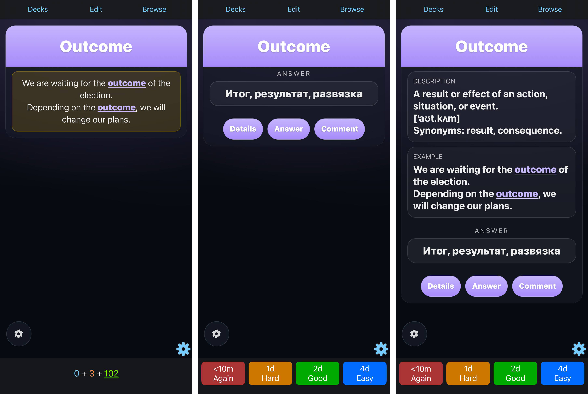
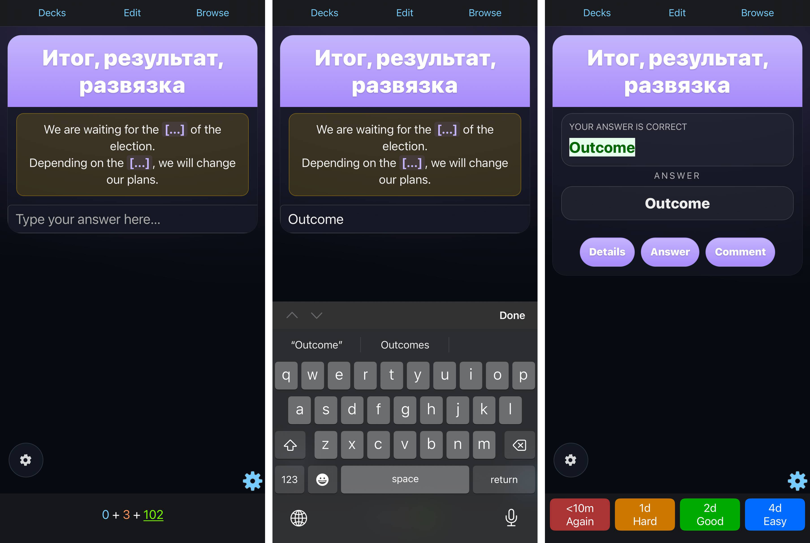
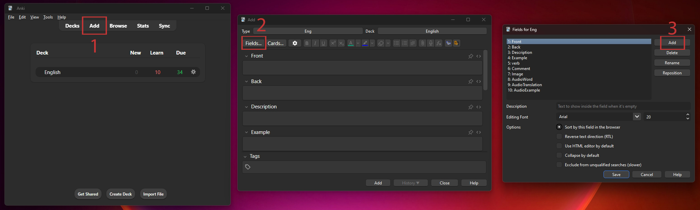
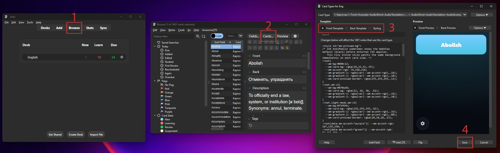

# Anki Card Template

A responsive Anki card template for learning vocabulary on desktop, iPhone,
and Android. It includes configurable speech, recorded MP3 audio, study
sequences, images, hints, themes, accents, and compact settings controls.

> Want to generate MP3 audio and add it to cards automatically? Use
> [Anki Voice Studio](https://github.com/RemyGremory/anki-voice-studio).

## Features

- Automatic speech for the front and back of a card.
- Choice of language, system voice, and speech speed for the word and
  translation.
- Optional recorded MP3 audio for the word, translation, and examples.
- Study mode with configurable cycles and audio sequences.
- Random Front/Back swapping for the next card.
- Show or hide hints, typed answers, details, comments, and images.
- A choice of dark/light theme and accent colours.
- Settings designed for both phones and Anki Desktop.

**Review modes:** examples on the front, a clear answer, and optional details
on the back.

**Type-answer mode:** hide the answer in an example, type it, and see the
result before grading the card.

## Installation

Before changing a note type, make an Anki backup.

1. In Anki Desktop, click **Add** and choose the note type you want to use.
2. In the Add window, click **Fields…**, then click **Add** in the Fields
   window.

   

3. Create the following fields if they do not already exist. For each missing
   field, click **Add**, enter its name exactly as shown, and confirm. Their
   order is not important, but the names must match exactly:

   `Front`, `Back`, `Description`, `Example`, `verb`, `Comment`, `Image`,
   `AudioWord`, `AudioTranslation`, `AudioExample`

4. Click **Save** to close the Fields window. In Anki's main window, click
   **Browse**, select a note that uses your chosen note type, then click
   **Cards…**. In the Card Types window, select **Front Template**, **Back
   Template**, or **Styling** as needed. If the note type has no notes yet,
   create one simple note first, then return to **Browse**.

   

5. In **Front Template**, select all existing code and replace it with the
   contents of `Front.html`.
6. In **Back Template**, select all existing code and replace it with the
   contents of `Back.html`.
7. In **Styling**, select all existing code and replace it with the contents
   of `Styleng.css`.
8. Click **Save**, then use **Preview** to check both sides of a card.
9. In Anki Desktop, click **Sync**. If Anki asks how to handle the template
   changes, choose **Upload to AnkiWeb** on the computer where you installed
   the template. Then, on a phone or other device where you use Anki, click
   **Sync** and choose **Download from AnkiWeb**. The updated note type and
   template will then be available on that device too.

## How to use the fields

To create a card, use **Add**, choose this note type, enter a word or phrase in
`Front` and its answer in `Back`, then fill in any optional fields you need.
`Front` and `Back` are the only fields required for a basic card.

| Field | Purpose |
| --- | --- |
| `Front` | Word or phrase to learn. |
| `Back` | Translation or answer. |
| `Description` | Explanation, transcription, or extra context. |
| `Example` | Example sentences. Separate lines are kept as separate lines. |
| `verb` | Optional verb forms. |
| `Comment` | Optional note or usage tip. |
| `Image` | An optional picture shown under the translation on the back and under the hint on the front. |
| `AudioWord` | Optional MP3 audio for the word. |
| `AudioTranslation` | Optional MP3 audio for the translation. |
| `AudioExample` | Optional MP3 audio for examples. |

To add an image, drag it into the `Image` field in Anki Desktop. Anki stores it
in its media collection and syncs it to mobile devices with the rest of the
collection.

## Settings

Open the gear button on a card to change its behaviour. The selected options
are saved locally on that device. Configure them separately on each phone or
computer where you use Anki.

Main settings include:

- automatic speech and skipping text in parentheses;
- study mode, sequence, repeat count, and random swapping;
- hints, type-answer mode, details, comments, and image visibility;
- theme and accent colour;
- languages, voices, and speech speed;
- whether to prefer recorded MP3 audio when it is present.

## Recorded audio

To create audio for many cards at once, use
[Anki Voice Studio](https://github.com/RemyGremory/anki-voice-studio). It can
make a CSV with MP3 files for new cards or add audio directly to selected
existing cards. The note type needs the `AudioWord`, `AudioTranslation`, and
`AudioExample` fields listed above. Afterwards, sync Anki as usual to use the
audio on iPhone or Android.

You can also add an MP3 manually in Anki Desktop: drag it into `AudioWord`,
`AudioTranslation`, or `AudioExample`.

## Notes

- The template also works without recorded MP3 files: it uses the speech voices
  available on the device instead.
- Some system voices are available only on a particular device. Downloaded iOS
  voices may not always be exposed to Anki’s browser engine, so recorded MP3
  audio is the most reliable way to get the same voice everywhere.
- The template does not include cards, images, personal audio, or voice data.
